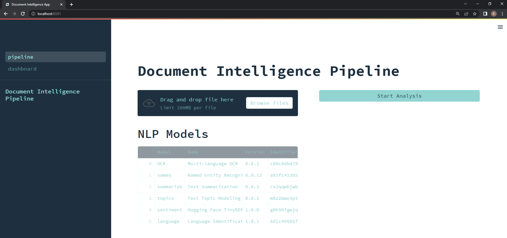

# Document Intelligence with Streamlit and Modzy


<div align="center">

<p float="center">
    
</p>

**This repository provides a sample NLP application that executes a document intelligence pipeline through Modzy APIs and generates a dashboard web application with Streamlit.**


<h3 align="center">
  <a href="https://docs.modzy.com/docs/streamlit">Full Tutorial</a>
  <span> · </span>   
  <a href="https://streamlit.io/">Streamlit.io</a>
</div>

## Overview

[Streamlit.io](https://streamlit.io/) is a powerful tool that allows Python developers to rapidly develop web apps and dashboards _without any front end coding experienced required_! Leveraging Modzy's ability to integrate AI/ML into any application with a few lines of code, this project provides an example implementation of an NLP web application using Modzy and Streamlit.

<br>

## Getting Started

Begin interactig with the example web app in your browser right away in just a few steps. To follow the instructions below, make sure you have met the following prerequisites:

1. Valid credentials for an active Modzy account (i.e., Modzy instance URL and Modzy Api Key)
2. A Python environment (v3.7+ recommended)

First, clone this repository into your environment and navigate to the top-level directory:

```bash
git clone https://github.com/modzy/modzy-streamlit-nlp-dashboard.git
cd modzy-streamlit-nlp-dashboard
```

Next, create a virtual environment (virtualenv, venv, conda all work) and activate it.

```bash
python3 -m venv streamlit-venv
```

_Linux or Mac OS_
```bash
source streamlit-venv/bin/activate
```

_Windows_
```cmd
.\streamlit-venv\Scripts\activate
```

Now, install the packages needed to run the Streamlit app:

```bash
pip install -r requirements.txt
```

The last step before running the web app is to set your Modzy URL (`MODZY_URL`) and Api Key (`MODZY_API_KEY`) as environment variables. Below provides an example of how to do so via the CLI:

_Linux or Mac OS_
```bash
export MODZY_URL="https://<your-modzy-instance-url>"
export MODZY_API_KEY="<your-api-key>"
```

_Windows_
```powershell
set MODZY_URL="https://<your-modzy-instance-url>"
set MODZY_API_KEY="<your-api-key>"
```

> Note: If you are running on Windows, you must pass through the bin file for the poppler Python package [here](./pipeline.py#L78).

<br>

Finally, run the application from your terminal:

```bash
streamlit run pipline.py
```

You should see the following in your terminal:

```bash

  You can now view your Streamlit app in your browser.

  Local URL: http://localhost:8501
  Network URL: http://10.0.0.240:8501
```

And in your browser:



From here, upload your own PDF or the sample PDF included (`./healthcare.pdf`), kickoff the analysis, and customize however you prefer (see more below)!

<br>

## Tips & Tricks for Customization

Streamlit makes it very easy to customize your web app. This repository contains _an example implementation_, but there are many ways to customize how you see fit. In this section, we provide a few quick customization tips to convert this app into your own.

First, below is a quick overview of this repository's contents:
* `.streamlit/`: Folder for various Streamlit customization files. Currently, the `config.toml` defines the color scheme and theme used for this sample app
* `css/`: Contains custom css code for modified styling
* `data/`: Contains data used by Modzy's Optical Character Recognition model
* `imgs/`: Contains images used in this README and the web app itself
* `pages/`: Contains the dashboard page for this application. Any Streamlit multi-page application expects additional pages to be included in this directory structure. See the [docs](https://docs.streamlit.io/library/get-started/multipage-apps/create-a-multipage-app) for more details
* `pipeline.py`: Python script that contains the code for the index page of our application
* `requirements.txt`: Contains Python dependencies required for this project

Below are a few customizations you might be looking for:

**Update Web Page Logo**: To update the logo that appears on your browswer tab, add your preferred logo to the `imgs/` folder, and replace the appropriate line in [pipeline.py](./pipeline.py#L12) and [dashboard.py](./pages/dashboard.py#L7).

**Update Color Scheme**: With your app pulled up, you can navigate to the menu bar on the top right of the screen, open settings, and select "Edit active theme." When you are happy with the changes you have made, click the "Copy theme to clipboard" button and replace the contents of `.streamlit/config.toml` with this content. Additional CSS styling can be tweaked in the `css/style.css` file.

**Update Model Pipeline**: Interested in changing the models and ML pipeline that is executed? If so, you will have to make changes in a few places. The `pipeline.py` file is written specifically to account for a set of open-source and Modzy-developed models that come with Modzy out of the box. This means parsing model outputs and passing through model inputs are set to the specifics of these models. To change out models with your own, edit the [`models`](./pipeline.py#L34-L54) dictionary and any specific function defined or required in [lines 103-192](./pipeline.py#L107-L196).

